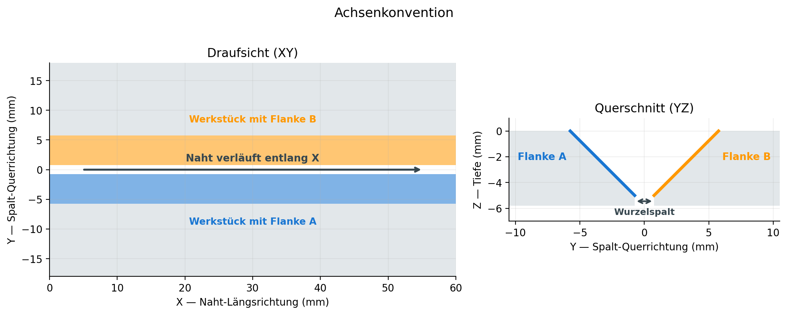
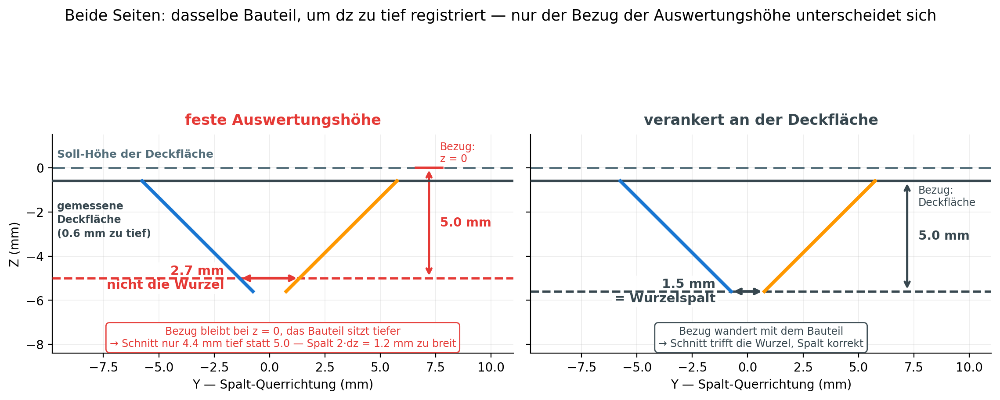
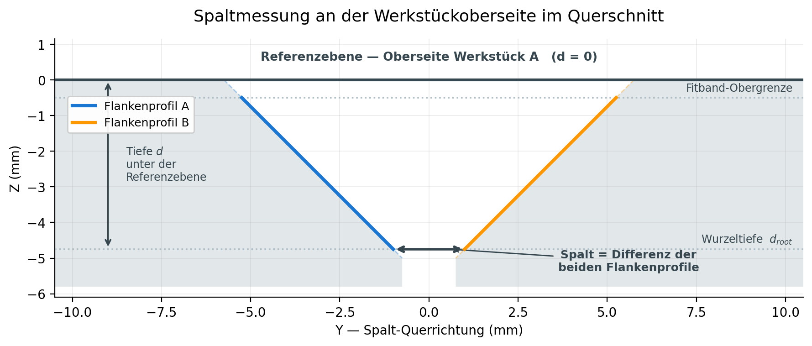

# Methodik der Abweichungsanalyse

**Konzeptionelle Referenz zum Verfahren AP2.2 → AP2.3**
Stand: 2026-07-22

---

## Zweck und Abgrenzung

Dieses Dokument beschreibt **was** das Verfahren tut und **warum** es so
aufgebaut ist. Es richtet sich an Projektpartner und dient der fachlichen
Rückschau — Implementierungsdetails stehen bewusst nicht darin, weil sie mit
dem Code veralten.

| Dokument | Inhalt |
|---|---|
| **dieses** | Verfahren, Geometrie, Verfahrensentscheidungen |
| `subtraction_pipeline.md` | Architektur und Modulstruktur (code-nah) |
| `fehleranalyse_achsen_und_registrierung.md` | Fehlersuche, Messwerte, Nachweise |

Pro Abschnitt steht ein knapper Hinweis, wo im Repository die Umsetzung grob
liegt. Messwerte werden hier nur zitiert, wo sie eine Entscheidung begründen;
die vollständigen Nachweise stehen in der Fehleranalyse.

### Was aus dem Arbeitsplan stammt und was Umsetzungsentscheidung ist

Diese Trennung wird im Folgenden durchgehalten, weil sie für die Bewertung des
Projektfortschritts wesentlich ist.

**Aus dem Arbeitsplan (AP2.2):** 3D-Registrierung mittels ICP,
Abweichungsanalyse CAD-Soll gegen realen Scan, Toleranzklassifikation ±0.25 mm.

**Aus dem Arbeitsplan (AP2.3):** Digitaler Zwilling, automatisierte
Qualitätsbewertung, Merkmalsextraktion für die RL-Optimierung in AP3.

**Umsetzungsentscheidungen dieses Projekts** — nicht im Arbeitsplan vorgegeben,
sondern aus der Bauteilgeometrie und den Messdaten abgeleitet: die
Achsenkonvention, die Aufteilung in Werkstückoberseite/Flanken/Spaltregion, die
an der Werkstückoberseite verankerte Spaltmessung, die Beschreibung jeder Flanke durch ein
eigenes Profil sowie die konkrete Auswahl der Qualitätsmerkmale.

---

## 1. Überblick

Aufgabe ist der Vergleich einer real geschweißten V-Naht mit ihrem CAD-Soll und
die Bewertung gegen die Toleranzanforderung von ±0.25 mm.

Das Verfahren läuft in vier Stufen:

1. **Segmentierung** — semantische Zerlegung der Punktwolke
2. **Registrierung** — Scan in das CAD-Koordinatensystem überführen
3. **Distanzbestimmung** — punktweise Abweichung, aggregiert und räumlich aufgelöst
4. **Spaltprofil** — Wurzelspalt und Flankengeometrie entlang der Naht

Die Reihenfolge ist nicht beliebig: Die Registrierung braucht Regionen, gegen
die sie ausrichten kann, und die Spaltmessung braucht die Flanken als
identifizierte Objekte.

### Achsenkonvention



Durchgängig gilt: **X** ist die Naht-Längsrichtung, **Y** die Spalt-Querrichtung,
**Z** die Tiefe. Die beiden Werkstücke liegen sich entlang Y gegenüber; die Naht
läuft entlang X.

Diese Konvention klingt nebensächlich, ist es aber nicht. Eine
Achsenverwechslung zwischen zwei Verarbeitungsstufen führt nicht zu einem
Fehler, sondern zu einem *leeren Ergebnis* — die Flankenerkennung findet dann
schlicht keine Kandidaten, ohne dass irgendwo etwas fehlschlägt. Genau dieser
Fall ist im Projekt aufgetreten und in der Fehleranalyse dokumentiert. Seither
ist die Konvention in allen Stufen explizit konfigurierbar statt implizit
angenommen.

---

## 2. Segmentierung als Voraussetzung

Bevor irgendetwas gemessen werden kann, muss klar sein, welcher Punkt wozu
gehört. Die Punktwolke wird in fünf Regionen zerlegt:

| Region | Bedeutung |
|---|---|
| Werkstückoberseite | ebene Oberseite der Bleche, Umgebung |
| Flanke A / Flanke B | die beiden Fasen der V-Naht |
| Spaltregion | freier Raum zwischen den Fasen |
| Sub-Spalt-Artefakte | Punkte unterhalb der Flankenunterkante |

**Die Flankenunterscheidung erfolgt über die Normalenrichtung, nicht über die
Position.** Das ist der entscheidende Punkt: Am Grund der V-Naht liegen beide
Flanken geometrisch dicht beieinander, eine Trennung nach Koordinaten wäre dort
unzuverlässig. Die Flächennormalen zeigen dagegen in entgegengesetzte
Richtungen — Flanke A zur einen, Flanke B zur anderen Seite. Das bleibt auch
dann eindeutig, wenn sich die Flanken räumlich fast berühren.

Voraussetzung dafür ist, dass die Normalen konsistent nach außen orientiert
sind. Kippt diese Orientierung, findet die Flankenerkennung nichts — auch das
ist ein real aufgetretener Fall.

**Heftnähte** erscheinen als Punkte innerhalb der Spaltregion: Material, das den
Spalt lokal überbrückt. Für die Auswertung heißt das zweierlei. Erstens sind die
Nahtenden, wo Heftpunkte typischerweise sitzen, von der Spaltmessung
ausgenommen. Zweitens schlägt sich eine Heftnaht als Störung im Flankenprofil
nieder — die Fit-Güte fällt dort ab und wird als eigenes Merkmal ausgegeben
(Abschnitt 5.5).

*Umsetzung grob:* `src/schweiss_ki/segmentation/`

---

## 3. Registrierung

Der Scan muss in das CAD-Koordinatensystem überführt werden, ohne dabei die
Abweichung wegzuoptimieren, die gerade gemessen werden soll.

### Zwei Registrierungen mit verschiedenen Aufgaben

Das ist die Stelle, an der leicht ein falsches Bild entsteht, deshalb ausdrücklich
getrennt:

| | was bewegt wird | Zweck |
|---|---|---|
| **Ausrichtung** | der **gesamte Scan** als ein Starrkörper | erzeugt die Punktwolke, auf der alles Weitere gemessen wird |
| **Komponenten-Vermessung** | jedes Werkstück für sich | ermittelt **nur** die Relativlage; die dabei bewegten Wolken werden verworfen |

**Die Ausrichtung bewegt beide Werkstücke gemeinsam.** Kein Teil wird
festgehalten, während das andere wandert — der Scan wird als Ganzes ins
CAD-System gedreht und verschoben. Alles, was danach gemessen wird, geschieht
auf dieser einen ausgerichteten Wolke.

**Die Relativlage wird gemessen, nicht hergestellt.** Für den Kennwert
„Kantenversatz und Verkippung" wird jedes Werkstück *rechnerisch* einzeln gegen
das CAD ausgerichtet und aus beiden Transformationen die Lage zueinander
bestimmt. Die so verschobenen Wolken werden verworfen — würde man sie behalten,
verschwände genau die Fehlstellung, die den Messwert ausmacht.

**Das CAD steht fest, der Scan wird bewegt.** Das Ideal-Bauteil ist das Ziel und
bleibt unverändert; ausgerichtet wird der reale Scan. Man könnte daraus
schließen, die Lage des Scans sei damit eindeutig bestimmt — sie ist es nicht,
und der Grund ist die Nahtgeometrie selbst.

### Warum die Ausrichtung nicht eindeutig ist

**Ein V koppelt Spaltbreite und Höhe.** Anhand der Flanken allein lässt sich
nicht unterscheiden, ob der Spalt breiter ist oder ob das Bauteil höher liegt —
bei 45°-Flanken ist beides geometrisch dasselbe. Es ist dieselbe Kopplung
`dw/dz = 2·tan(α)`, die in Abschnitt 5.2 die Messverstärkung verursacht.

Ist der Spalt im Scan breiter als im CAD, passen die Flanken folglich besser
zusammen, wenn die Ausrichtung den Scan **anhebt** — dort ist das CAD-V weiter.
Die Flanken drängen also auf einen Höhenversatz.

**Dagegen hält die Werkstückoberseite.** Sie ist horizontal, legt die Höhe
unmittelbar fest und stellt die große Mehrheit der Punkte — beim Referenzbauteil
rund 437.000 gegenüber 67.000 auf beiden Flanken. Was die Ausrichtung
schließlich tut, ist das Gleichgewicht dieser beiden Ansprüche.

Messbar ist das deutlich: Über die Translationsserie wächst der Höhenversatz
streng linear mit der Spaltabweichung (Korrelation 0.9997), mit einem Verhältnis
von rund 0.038 mm Höhe je mm Spalt. Eine überschlägige Rechnung aus den
Punktzahlen liefert dieselbe Größenordnung.

**Folge für die Spaltmessung.** Die Ausrichtung verschiebt damit ausgerechnet
die Größe, die anschließend gemessen werden soll — und zwar umso mehr, je größer
die Abweichung ist. Wird gegen eine feste Höhe im Koordinatensystem ausgewertet,
geht dieser Versatz verstärkt in das Ergebnis ein (Abschnitt 5.2).

Die `2·tan(α)`-Kopplung tritt im System also zweimal auf: einmal als
Mehrdeutigkeit bei der Ausrichtung, einmal als Verstärkung bei der Messung. Die
Verankerung durchbricht diesen Kreis, weil sie den Höhenbezug aus der
Werkstückoberseite nimmt — der einzigen beteiligten Fläche, deren Lage nicht von
der Spaltbreite abhängt.

**Nur ICP, keine PCA-Grobausrichtung.** Eine Hauptachsentransformation als
Vorstufe ist der übliche Weg, scheitert hier aber an der Bauteilgeometrie: Das
Blech ist rund 199 × 98 × 5 mm groß. Die dritte Hauptachse — die Dickenrichtung
— ist gegenüber den anderen beiden winzig und damit numerisch schlecht
bestimmt. Die Vorzeichenwahl der Hauptachsen wird dadurch unzuverlässig, und
eine falsche Wahl verschiebt das Bauteil um etwa die halbe Blechdicke. Die
nachfolgende Feinausrichtung startet dann aus einer falschen Lage und findet nur
noch ein lokales Optimum.

Der Verzicht ist eine Entscheidung **für vorausgerichtete Daten**: Sowohl die
synthetischen Fälle als auch eingemessene CMM-Scans liegen bereits näherungsweise
im CAD-Koordinatensystem. Für Scans in beliebiger Lage wäre eine Grobausrichtung
nötig — dann allerdings eine, die die schlecht konditionierte Achse gesondert
behandelt.

**Zerlegung der Relativlage.** Die gefundene Transformation zwischen den beiden
Werkstücken wird in Translation und Euler-Winkel zerlegt. Dabei ist eine
Feinheit zu beachten: Eine Rotation um einen Punkt außerhalb des
Werkstückschwerpunkts erzeugt rechnerisch einen Translationsanteil, der physisch
keine Verschiebung ist. Die Zerlegung rechnet diesen Anteil heraus, sodass bei
reiner Verkippung auch reine Verkippung berichtet wird — sonst wäre der
Kennwert „Versatz" bei jedem verdrehten Bauteil irreführend.

*Umsetzung grob:* `src/schweiss_ki/subtraction/registration/`

---

## 4. Distanzbestimmung

**Signierter Abstand.** Für jeden Scanpunkt wird der Abstand zur nächsten
CAD-Oberfläche bestimmt — mit Vorzeichen. Das Vorzeichen unterscheidet, ob an
dieser Stelle Material **fehlt** oder **übersteht**. Ein reiner Betrag würde
beide Fälle vermengen, obwohl sie fertigungstechnisch völlig verschiedene
Ursachen und Konsequenzen haben.

**Aggregation auf drei Ebenen.** Ein einzelner Kennwert über das ganze Bauteil
ist notwendig, aber nicht hinreichend:

- **global** — ein Gesamturteil für die Toleranzbewertung
- **je Region** — weil ein guter Gesamtwert eine schlechte Flanke verdecken
  kann. Die Werkstückoberseite stellt die überwiegende Mehrheit der Punkte; eine
  fehlerhafte Fase geht im Mittelwert unter
- **räumlich, voxelbasiert** — das Bauteil wird in Würfel zerlegt und je Würfel
  ausgewertet. Damit werden lokale Häufungen sichtbar, die selbst in der
  regionsweisen Auswertung noch untergehen: ein Defekt auf zwei Zentimetern
  Nahtlänge verschwindet im Mittel über zwanzig Zentimeter

Die **Toleranzbewertung gegen ±0.25 mm** ist Vorgabe aus dem Arbeitsplan; die
dreistufige Aggregation ist Umsetzungsentscheidung.

*Umsetzung grob:* `src/schweiss_ki/subtraction/deviation/`

---

## 5. Spaltmessung an der Werkstückoberseite

Dies ist das Kernstück des Verfahrens und die Stelle, an der die meisten
methodischen Entscheidungen zusammenlaufen.

### 5.1 Das Problem einer festen Auswertungshöhe

Der Wurzelspalt ist keine einzelne Zahl. Eine V-Naht öffnet sich nach oben —
die Spaltbreite hängt davon ab, in welcher Tiefe man misst. Jede Spaltangabe
muss also sagen, *wo* gemessen wurde.

Die naheliegende Wahl ist eine feste Höhe im Koordinatensystem, etwa die
Nullebene. Genau das koppelt die Messung aber an die Registrierung: Liegt der
Scan nach der Ausrichtung um einen Betrag `dz` zu hoch oder zu tief, schneidet
eine feste Ebene das Bauteil an der falschen Stelle an.

### 5.2 Der Verstärkungsfaktor

Der Effekt ist nicht nur vorhanden, er ist **verstärkt**. Bei einer V-Naht mit
Flankenwinkel α zur Vertikalen wächst die Spaltbreite pro Tiefeneinheit um

```
dw/dd = 2 · tan(α)
```

Der Faktor 2 entsteht, weil sich *beide* Flanken öffnen. Ein Höhenfehler geht
damit vervielfacht in die Spaltbreite ein:

| Nahtöffnung | Flankenwinkel α | Verstärkungsfaktor |
|---|---|---|
| 60° | 30° | 1.15 |
| 75° | 37.5° | 1.53 |
| **90°** | **45°** | **2.00** |
| 100° | 50° | 2.38 |

Für das aktuelle Bauteil mit 90°-Öffnung bedeutet das: **Jeder Millimeter
Registrierungsfehler in der Höhe erzeugt zwei Millimeter Fehler in der
Spaltbreite.** Je spitzer die Naht, desto empfindlicher — eine Eigenschaft, die
bei künftigen Bauteilen mit anderer Nahtvorbereitung neu zu bewerten ist.



*Beide Seiten zeigen dasselbe Bauteil, um `dz` = 0.6 mm zu tief registriert.
Gemessen wird jeweils 5 mm unter dem Bezug — links ab der Nullebene des
Koordinatensystems, rechts ab der Oberseite des Bauteils. Links liegt der
Schnitt dadurch nur 4.4 mm tief im Material und trifft die Wurzel nicht: 2.7 mm
statt 1.5 mm, also `2·dz` = 1.2 mm zu breit. Rechts wandert der Bezug mit dem
Bauteil, der Schnitt trifft die Wurzel und liefert den korrekten Wert.*

### 5.3 Die Verankerung

Die Lösung ist, den Höhenbezug nicht aus dem Koordinatensystem zu nehmen,
sondern **aus dem Bauteil selbst**: Die Oberseite des Referenz-Werkstücks wird
aus dem Scan bestimmt und definiert die Tiefe null. Alle Tiefen werden relativ
dazu gemessen.

Damit fällt der Registrierungsversatz strukturell heraus. Verschiebt sich der
Scan, verschiebt sich die Referenzebene mit — die Tiefe im Bauteil bleibt
dieselbe. Die Messung ist gegen **Starrkörper-Fehlstellungen invariant**,
gleichgültig wie groß sie sind.

Das leistet dasselbe, was ein Festhalten des Referenz-Werkstücks bei der
Ausrichtung leisten würde — nur ohne die Ausrichtung einzuschränken. Wo die
Registrierung das Bauteil hinlegt, ist für den Spalt gleichgültig, weil der
Höhenbezug aus dem Bauteil selbst kommt und nicht aus dem Koordinatensystem.
Die Ausrichtung bleibt damit frei, den Gesamtfehler gegen das CAD zu
minimieren — was sie für die Distanzbestimmung (Abschnitt 4) auch soll.

**Zwei getrennte Ebenen, nicht eine gemeinsame.** Die Werkstückoberseite wird je
Werkstück eigenständig bestimmt. Dafür gibt es zwei unabhängige Gründe:

*Erstens die Geometrie.* Sind die Werkstücke gegeneinander verkippt — was
gerade der interessante Fehlerfall ist — existiert keine gemeinsame Ebene. Ein
gemeinsamer Fit findet dann die dominante Hälfte und behandelt die andere als
Ausreißer; ein erheblicher Teil der Werkstückoberseite bleibt unklassifiziert.

*Zweitens die Eindeutigkeit.* Ein gemeinsamer Fit muss bei Verkippung zwischen
zwei konkurrierenden Ebenen **wählen**. Diese Wahl hängt von der zufälligen
Stichprobe des Ausgleichsverfahrens ab und fällt bei wiederholter Auswertung
unterschiedlich aus — dasselbe Bauteil liefert leicht abweichende Messwerte. Je
Werkstück getrennt betrachtet existiert dagegen genau eine Ebene; die Aufgabe
ist eindeutig lösbar und das Ergebnis reproduzierbar. Die Auflösung dieses
Reproduzierbarkeitsproblems war ein Nebeneffekt der Entscheidung, nicht ihr
Anlass.

**Die Abhängigkeit ist verlagert, nicht beseitigt.** Der Verstärkungsfaktor
gilt jetzt für Fehler der Referenzebene selbst: Liegt der Ebenenfit um δ
daneben, geht δ mit demselben Faktor `2·tan(α)` ein. Die Genauigkeit der
Spaltmessung hängt damit an der Qualität dieser Ebene. Bei realen Scans sitzen
auf der Werkstückoberseite Spritzer und Reflexionen. Die Ebenenbestimmung ist
deshalb ausreißerrobust ausgelegt, gibt Gütemaße mit aus und verweigert die
Auswertung, wenn die Werkstückoberseite zu stark gestört ist — lieber kein Wert
als ein falscher Bezug.

**Ein systematischer Anteil von δ ist bekannt: die Ebene sitzt minimal zu
tief.** Als Background zählt alles innerhalb der Toleranzbreite um die Ebene.
Am Übergang zur Fase fallen dadurch Flankenpunkte in dieses Band — aber nur
*unterhalb* der Oberfläche, denn darüber ist nichts. Die Punktverteilung ist
also einseitig, und weil der Ebenenfit den Mittelwert seiner Inlier trifft,
zieht dieser einseitige Anteil die Ebene nach unten.

Gemessen an den synthetischen Scans: 99.2 % der Punkte liegen exakt auf der
Oberfläche, 0.8 % darunter, keiner darüber. Die gefittete Ebene liegt
**0.001 mm** unter der wahren Oberfläche — exakt auf dem Mittelwert der
Punkte, nicht auf ihrem Median.

Der Betrag ist hier bedeutungslos (0.4 % der Toleranz, selbst mit Faktor 2).
Der Mechanismus ist aber systematisch und wird bei realen Scans größer, wo der
Übergangsbereich einen höheren Anteil der Punkte stellt. Messrauschen wirkt
demgegenüber symmetrisch und erzeugt keinen Versatz — der Beitrag kommt allein
aus der Einseitigkeit der Geometrie. Wer ihn beseitigen will, hat zwei Wege:
das Band für den Ebenenfit enger fassen als für die Klassifikation, oder statt
des Mittelwerts ein oberes Quantil verwenden.

### 5.4 Zwei getrennte Flankenprofile



Jede Flanke wird **unabhängig** als Funktion der Tiefe unter der Referenzebene
beschrieben. Die Spaltbreite ergibt sich als Differenz der beiden Profile.

Der Vorteil gegenüber einer direkten Spaltmessung liegt in dem, was sichtbar
wird:

- **Asymmetrische Nahtvorbereitung** — ist nur eine Flanke schief, zeigt sich
  das im Vergleich der beiden Profile. Eine reine Spaltbreite kann nicht
  unterscheiden, welche Seite abweicht
- **Einseitig fehlende Abdeckung** — hat eine Flanke in einem Bereich keine
  Messpunkte, bleibt das Profil der anderen davon unberührt. Bei gekoppelter
  Auswertung würde die fehlende Seite die vorhandene mit entwerten

Der **Wurzelspalt** wird an der tiefsten Stelle ausgewertet, an der *beide*
Flanken belegt sind. Das ist bewusst ein Messwert und keine Extrapolation über
die Daten hinaus: Die tatsächliche Wurzel ist bei durchgehendem Spalt oft nicht
erfasst, und ein extrapolierter Wert würde eine Genauigkeit vortäuschen, die die
Messung nicht hergibt. Der Preis ist ein kleiner systematischer Versatz, weil
die Auswertetiefe knapp oberhalb der echten Wurzel liegt — er ist konstant,
bekannt und in der Fehleranalyse beziffert.

### 5.5 Abgeleitete Größen

Aus den beiden Flankenprofilen ergeben sich mehrere Kennwerte, die über die
Spaltbreite hinausgehen:

| Größe | Aussage |
|---|---|
| **Flankenwinkel je Seite** | tatsächliche Nahtvorbereitung |
| **Flankenasymmetrie** | Differenz beider Winkel |
| **Kantenversatz** | Höhenversatz der Werkstücke zueinander |
| **relative Verkippung** | Winkel zwischen den Werkstückoberseiten |
| **Fit-Güte je Flanke** | Profilstörungen, etwa durch Heftnähte |

Bemerkenswert ist der erste Punkt: Der Flankenwinkel wird **gemessen, nicht
vorausgesetzt**. Ein Verfahren, das den Sollwinkel als bekannt annimmt, kann
eine fehlerhafte Nahtvorbereitung nicht erkennen — die Abweichung vom Soll ist
selbst ein Qualitätsmerkmal.

*Umsetzung grob:* `src/schweiss_ki/subtraction/deviation/`, visuelle Kontrolle
über die Querschnittsdarstellung in `src/schweiss_ki/subtraction/plots.py`

---

## 6. Qualitätsmerkmale für AP2.3 und AP3

Der Arbeitsplan sieht für AP2.3 eine automatisierte Qualitätsbewertung und die
Merkmalsextraktion für die RL-Optimierung in AP3 vor. **Welche** Merkmale das
sind, ist Umsetzungsentscheidung — und sie orientiert sich am realen
Ausschusskriterium des Projektpartners.

### Das zugrundeliegende Fehlerbild

Bei Heidenbluth entsteht Ausschuss vor allem durch **fehlplatzierte Heftnähte**:
Werden die Bauteile vor dem Schweißen falsch positioniert und geheftet, stimmt
die Spaltgeometrie nicht mehr. Der Roboter schweißt dann gegen eine Naht, die
nicht der Programmierung entspricht.

Daran orientiert sich die Merkmalsauswahl:

| Merkmal | Was es abbildet |
|---|---|
| **Spaltbreite entlang der Naht** | die Fehlplatzierung direkt — zu weit, zu eng, keilförmig |
| **Kantenversatz** | Höhenversatz der Bauteile, den die Spaltbreite nicht sieht |
| **Flankenasymmetrie** | einseitige Fehlstellung oder abweichende Nahtvorbereitung |
| **Fit-Güte** | lokale Störungen wie überstehende Heftnähte |
| **Abweichungsverteilung** | global, je Region und räumlich aufgelöst |

Die Begründung für diese Zusammenstellung: Die Spaltbreite allein greift zu
kurz. Zwei Bauteile können denselben Spalt bei völlig verschiedener Lage haben
— etwa gegeneinander höhenversetzt oder verkippt. Kantenversatz und Asymmetrie
fangen genau die Fehlerbilder, die eine reine Spaltangabe nicht unterscheiden
kann.

Alle Größen liegen als Skalare beziehungsweise als Verlauf entlang der Naht vor
und sind damit direkt als Merkmalsvektor verwendbar. Die
**Toleranzklassifikation gegen ±0.25 mm** *(Arbeitsplan)* setzt darauf auf.

---

## 7. Bekannte Grenzen

Ausführlich mit Messwerten in
`fehleranalyse_achsen_und_registrierung.md`; hier nur die konzeptionelle
Einordnung.

**Systematischer Versatz an der Wurzel.** Die Auswertetiefe liegt knapp oberhalb
der tatsächlichen Wurzel, wodurch der Spalt geringfügig zu klein gemessen wird.
Der Versatz ist konstant, ohne Streuung und über einen Parameter justierbar. Er
wurde bewusst belassen, weil die Alternative — Auswertung am äußersten
Messpunkt — ausreißerempfindlich wäre.

**Grenze bei starker Querverkippung.** Ab etwa einem Grad Verkippung um die
Spalt-Querachse findet die Registrierung ein abweichendes Optimum. Auf die
Spaltmessung wirkt sich das nicht aus — sie ist gegen Starrkörper-Fehlstellungen
invariant —, wohl aber auf die Distanzbestimmung, die auf eine gute Ausrichtung
angewiesen ist.

**Invarianz gilt gegen Starrkörperfehler, nicht gegen Verzerrung.** Diese
Einschränkung ist wichtig und wird leicht überlesen: Die Verankerung macht die
Messung unempfindlich gegen Verschiebung und Verdrehung des *gesamten*
Bauteils. Gegen eine tatsächliche Verformung — ein verzogenes Blech, eine
gekrümmte Werkstückoberseite — hilft sie nicht. Dort ist die Referenzebene selbst keine
Ebene mehr, und die Grundannahme des Verfahrens greift nicht.

**Reproduzierbarkeit.** Auf synthetischen Daten liefern wiederholte Auswertungen
identische Ergebnisse. Ursache ist nicht ein fester Zufallsstartwert, sondern die
Beseitigung der Mehrdeutigkeit durch die getrennten Referenzebenen
(Abschnitt 5.3) — es gibt keine Wahl mehr zu treffen. Bei realen Scans mit
verrauschten Normalen kann die Ebenenbestimmung wieder Spielraum bekommen; das
ist an den Heidenbluth-Daten zu prüfen, sobald sie vorliegen.

**Synthetisch ist nicht real.** Alle bisherigen Kennzahlen stammen aus
synthetischen Scans mit exakten Oberflächennormalen und ohne Messrauschen. Sie
belegen, dass das Verfahren geometrisch korrekt arbeitet — nicht, wie es sich
unter realen Messbedingungen verhält. Insbesondere Spritzer und Reflexionen auf
der Werkstückoberseite treffen mit der Referenzebene genau die Größe, an der die
Genauigkeit der Spaltmessung hängt.

---

## Abbildungen

Die Abbildungen sind schematisch und erklären die Geometrie; sie zeigen keine
Messdaten. Erzeugt über `scripts/generate_methodik_figures.py`
(PNG, 200 dpi — bewusst kein SVG, da es in PowerPoint fehlerhaft rendert).
